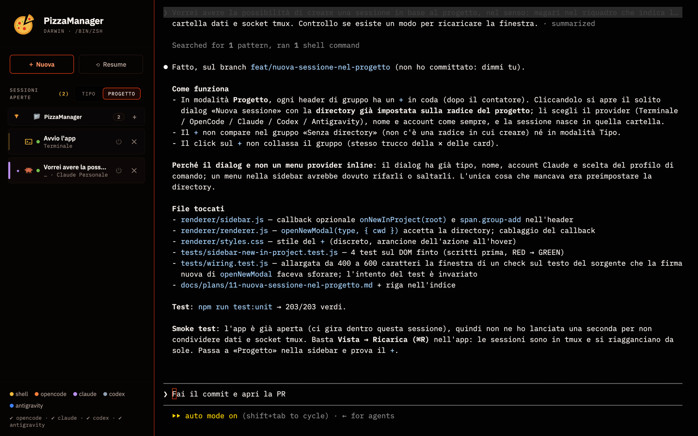

<p align="center">
  
</p>

<h1 align="center">PizzaManager</h1>

<p align="center">
  Tutte le tue sessioni di Claude Code, Codex, OpenCode e terminale in una finestra sola.<br>
  Ogni scheda è un terminale vero. Con tmux, le sessioni sopravvivono anche alla chiusura dell'app.
</p>

<p align="center">
  <a href="#scarica">Scarica</a> ·
  <a href="#cosa-fa">Cosa fa</a> ·
  <a href="#si-aggiorna-da-sé">Aggiornamenti</a> ·
  <a href="#cosa-serve">Cosa serve</a> ·
  <a href="#quando-qualcosa-non-va">Problemi</a>
</p>

<p align="center">
  <a href="../../releases/latest"></a>
  
  
  
  <a href="LICENSE"></a>
</p>

<p align="center">
  
</p>

Se lavori con più agenti AI da terminale, finisci con dieci finestre aperte, nessuna che dice cosa sta facendo, e ogni tanto una che chiudi per sbaglio a metà lavoro. PizzaManager le mette in una finestra sola, con una sidebar che ti dice **quale agente, in quale progetto, e se ha finito**. Nessun account, nessun servizio in mezzo: gira sul tuo computer e lancia i binari che hai già installato.

> Qui ci sono solo i pacchetti da scaricare. Il codice è in un repository privato: questo repo esiste perché i link di download funzionino per chiunque, senza account.

## Scarica

| Sistema | File | Poi |
|---|---|---|
| **macOS** Apple Silicon (M1–M4) | [**PizzaManager-mac-arm64.dmg**](../../releases/latest/download/PizzaManager-mac-arm64.dmg) | apri e trascina l'app in *Applicazioni* |
| **macOS** Intel | [**PizzaManager-mac-x64.dmg**](../../releases/latest/download/PizzaManager-mac-x64.dmg) | come sopra |
| **Linux** | [**PizzaManager-linux-x86_64.AppImage**](../../releases/latest/download/PizzaManager-linux-x86_64.AppImage) | `chmod +x` e lancia |
| **Linux** (Debian/Ubuntu) | [PizzaManager-linux-amd64.deb](../../releases/latest/download/PizzaManager-linux-amd64.deb) | `sudo dpkg -i` |

Non sai quale Mac hai?  → *Informazioni su questo Mac*: se dice «Apple M…» prendi **arm64**, se dice «Intel» prendi **x64**.

Su Linux l'**AppImage è la scelta consigliata**: è l'unico formato che si aggiorna da sé (il `.deb` lo gestisce `apt`).

Nella pagina delle [release](../../releases) trovi anche dei file `.zip`, `.blockmap` e `latest-*.yml`: non servono a te, sono i file con cui l'app si aggiorna da sola.

### Alla prima apertura

- **macOS**: niente da fare. Il `.dmg` è firmato con un Developer ID e notarizzato da Apple, quindi si apre come qualsiasi altra app scaricata.
- **Linux**: niente da fare.
- **Windows**: non c'è ancora un pacchetto.

## Cosa fa

|  |  |
|---|---|
| 🍕 **Un posto per tutto** | Terminale, [Claude Code](https://github.com/anthropics/claude-code), [Codex](https://github.com/openai/codex), [OpenCode](https://opencode.ai) e [Antigravity](https://antigravity.google) in schede, con l'icona di ciascuno |
| 🔥 **Le sessioni non muoiono** | Con `tmux` ogni sessione vive fuori dall'app: chiudi la finestra, riapri, è ancora lì. Dopo un riavvio del computer ti propone di ripristinarle, e nelle shell ritrovi anche il testo che c'era |
| 🗂 **Raggruppate come pensi** | Per agente o per progetto (la radice del repository). Il `+` di un progetto apre una sessione nuova direttamente lì |
| 🔔 **Sai quando ha finito** | Una scheda in secondo piano lampeggia quando l'agente smette di scrivere, e se vuoi arriva una notifica di sistema: il turno è tuo |
| ⟲ **Resume** | Riprendi una conversazione di Claude, Codex, OpenCode o Antigravity dal suo elenco, col titolo giusto — e cercala per testo fra tutte quelle passate |
| 🌿 **Git e worktree** | La mappa dei branch, il cambio di branch, e una sessione in un `git worktree` isolato: due agenti sullo stesso repo smettono di pestarsi i file |
| 👁 **Cosa ha cambiato** | Un pannello col `diff` di quello che l'agente ha toccato, aggiornato mentre lavora |
| 👤 **Più account Claude** | Login OAuth più chiavi API aggiuntive, o profili separati con `CLAUDE_CONFIG_DIR`; scegli a ogni sessione |
| ⚙️ **Comandi tuoi** | Per ogni tipo puoi definire più comandi di avvio (`claude --model opus`, variabili d'ambiente, ecc.) |

## Si aggiorna da sé

Dalla **1.2.0** non devi più tornare qui. L'app controlla da sola se c'è una versione nuova, la scarica mentre lavori e te lo dice **quando ha già finito**: il banner in cima dice «La versione è pronta», e *Riavvia ora* dura due secondi perché il pacchetto è già sul disco. Le sessioni aperte tornano al loro posto.

Se il momento è sbagliato, *Più tardi* lo manda via e lo ritrovi alla riapertura.

Due eccezioni: con il `.deb` gli aggiornamenti restano in mano ad `apt` (il banner avvisa e apre questa pagina), e su Windows il pacchetto ancora non c'è.

La versione installata si legge in **Help → Informazioni su PizzaManager**.

## Cosa serve

Le CLI degli assistenti si installano a parte: l'app lancia quelle che trova nel `PATH`, e la legenda in basso a sinistra dice quali ha trovato.

[`tmux`](https://github.com/tmux/tmux) è **opzionale ma consigliato** su macOS e Linux: è quello che fa sopravvivere le sessioni alla chiusura dell'app. Senza, i processi si chiudono con la finestra.

```sh
brew install tmux          # macOS
sudo apt install tmux      # Debian/Ubuntu
```

### Dove stanno i tuoi dati

Niente telemetria e nessun account. Tutto sta in una cartella sul tuo computer:

| Sistema | Cartella |
|---|---|
| macOS | `~/Library/Application Support/AISessionManager` |
| Linux | `~/.config/AISessionManager` |

L'app fa una sola richiesta di rete per conto suo — i font, e offline usa quelli di sistema — più il controllo degli aggiornamenti su questa pagina. Tutto il resto sono le connessioni delle CLI che avvii tu.

## Quando qualcosa non va

**«Binario `claude` non trovato nel PATH».** Le app avviate dal Finder o dal menu non ereditano il PATH della tua shell. PizzaManager lo chiede alla shell di login e cerca nei posti tipici (nvm, volta, Homebrew, `~/.local/bin`), ma se il tuo è altrove scrivi il percorso completo in *File → Configurazione comandi…*. Il tooltip della legenda in basso a sinistra dice dove ha cercato.

**Il comando funziona nel terminale ma non qui.** Probabilmente è un alias o una funzione di shell: qui i comandi girano senza shell. Riscrivilo per esteso, variabili comprese.

**Le sessioni spariscono chiudendo l'app.** `tmux` non è installato o non è nel `PATH`; la legenda in basso lo dice. Dopo averlo installato, riavvia l'app.

**Una sessione tmux resta appesa.** `tmux -L aisession ls` per vederle, `tmux -L aisession kill-session -t <nome>` per chiuderne una. Mai `kill-server` senza `-L aisession`: colpiresti le tue sessioni personali.

**Il banner dell'aggiornamento non compare.** Il primo controllo è 10 secondi dopo l'avvio e poi ogni 4 ore: se hai appena aperto l'app, aspetta un attimo. Con il `.deb` non comparirà mai in forma automatica, per scelta.

## Licenza

PizzaManager è software **proprietario**: si può installare e usare
liberamente, su quanti computer vuoi, senza costi e senza registrazione. Non
si può ridistribuire né modificare. Il testo completo è in
[`LICENSE`](LICENSE).

I componenti di terze parti che l'app impacchetta — tutti con licenze
permissive — sono elencati con le rispettive licenze in
[`THIRD-PARTY-NOTICES.md`](THIRD-PARTY-NOTICES.md).

Copyright © 2026 Giacomo Grieco e Alessandro Cadei.
